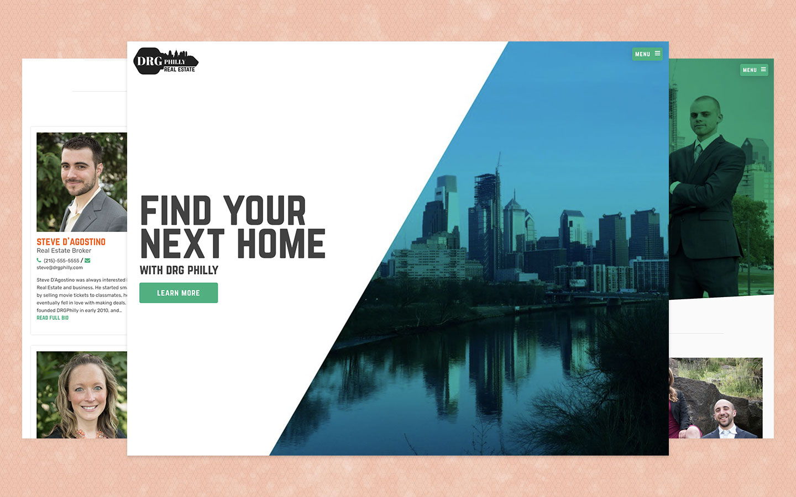

<figure class="project-hero">
  
</figure>

 

I linked up with this local Real Estate Company to refresh their brand identity and relaunch their web platform. We met regularly throughout the design and development process until the client felt completely satisfied with the end result. [You can view this project here](https://drgphilly.com/)

## My Role
Freelance Designer & Web Developer

## Project Tools
Sketch, Photoshop, WordPress, Gulp, Sass, ES6

## Responsibilities
- Update existing branding and solidify the DRG Brand statement through the creation/expansion of the color palette and brand typography
- Build, test, launch and maintain a new WordPress theme for the DRG Philly Team
