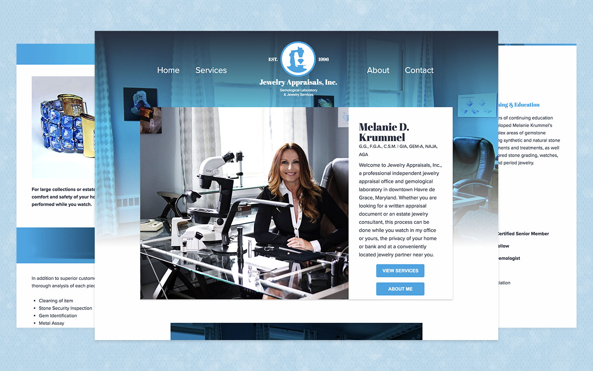

 

I worked with Jewelry Appraisals, Inc. to provide them with a fresh new rebrand, complemented by a revamped web experience. To move this project quickly, I had coded the site using HTML, Sass, and CodeKit for preprocessing. [You can view this project here](http://jewelryappraisalsinc.com/)

## My Role
Freelance Designer & Web Developer

## Project Tools
Photoshop, Sketch, Pen & Paper, HTML, Sass, JavaScript, CodeKit

## Responsibilities
- Rebrand the look and feel of Jewelry Appraisals, Inc. with a new color palette, logo and website
- Launch and maintain a hand-coded web experience
