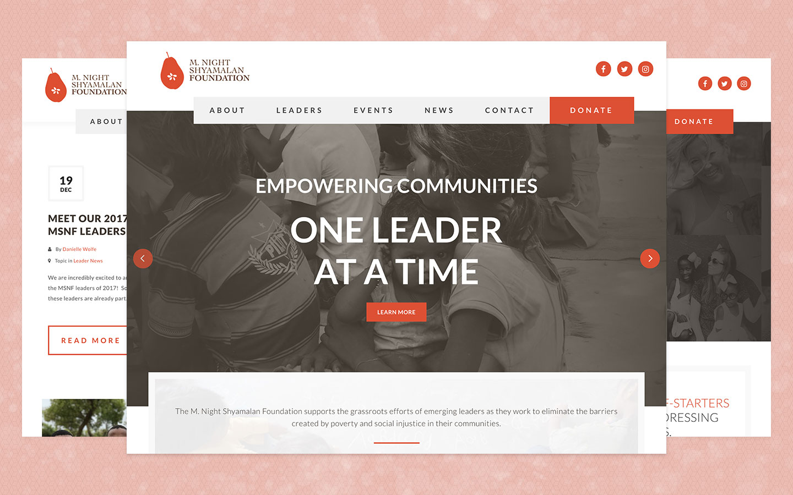

 

Working in collaboration with Lynx & Co., we prepared the Foundation's website for their biggest event, Shyamaween. Using their Wordpress platform, we created an event details page and handled ticket purchases on-site. [You can view this project here](https://www.mnsfoundation.org/)

## My Role
Freelance Web Developer

## Project Tools
Photoshop, WordPress, Gulp, Sass, ES6, Git

## Responsibilities
- Complete an unfinished project on a tight deadline after a previous developer dropped out
- Perform maintenance and performance analyses
- Transfer site DNS
