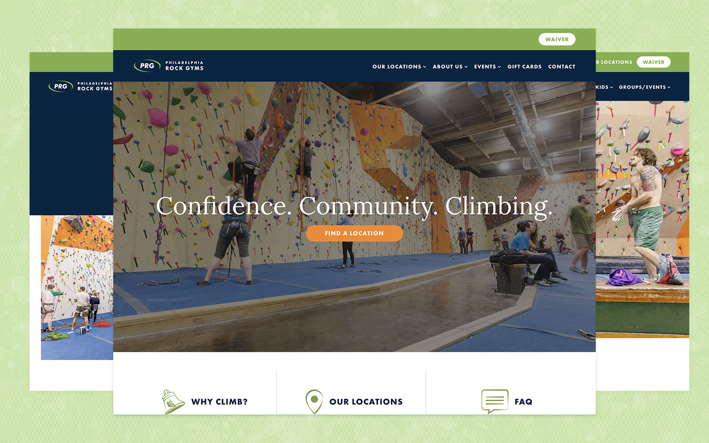

 

I worked with Philadelphia Rock Gym's freelance designer to turn their website refresh from Adobe Illustrator mocks to pixel perfect web pages. Leveraging their existing WordPress Platform, I created a brand new, custom theme using the latest web technologies. You can view this project [You can view this project here](https://www.philarockgym.com/)

## My Role
Freelance Web Developer
## Project Tools
  WordPress, Gulp, Sass, ES6, jQuery

## Responsibilities
- Launch a newly redesigned web platform for PRG
- Collaborate with a freelance designer to ensure that implemented pages appeared as designed
- Communicate with business stakeholders to hit deadlines and build key pages and features on-time and on-budget
